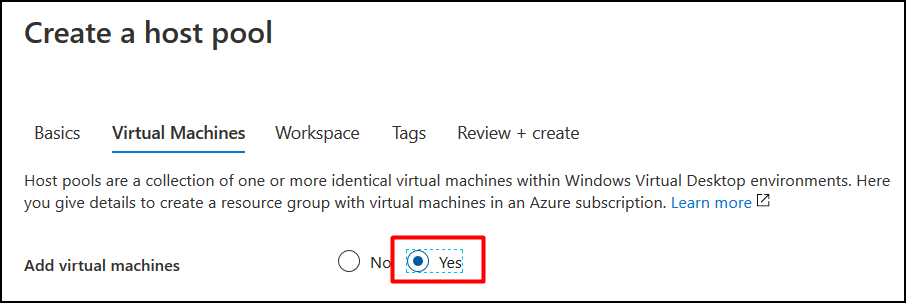
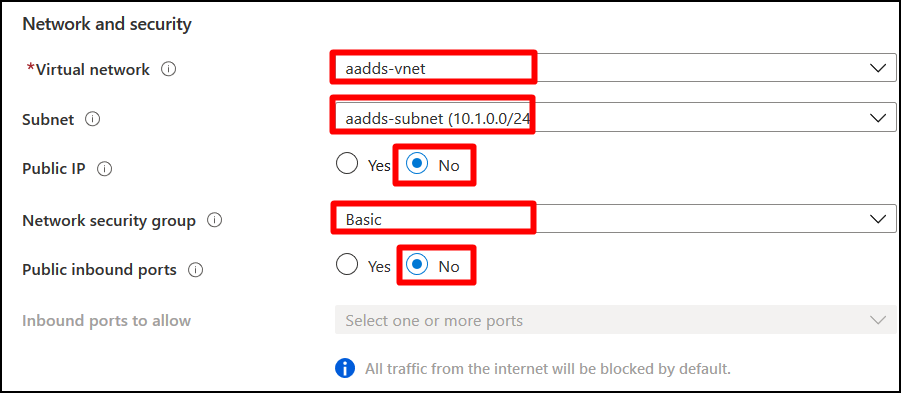
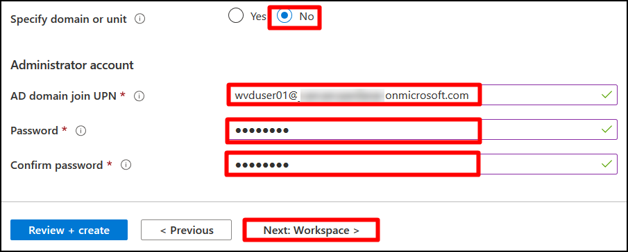
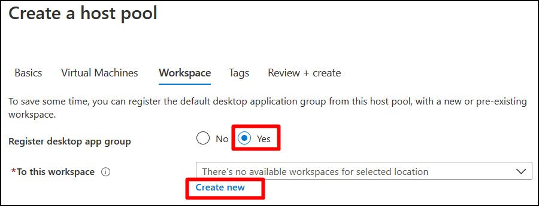
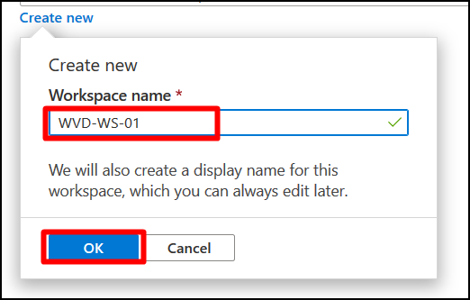
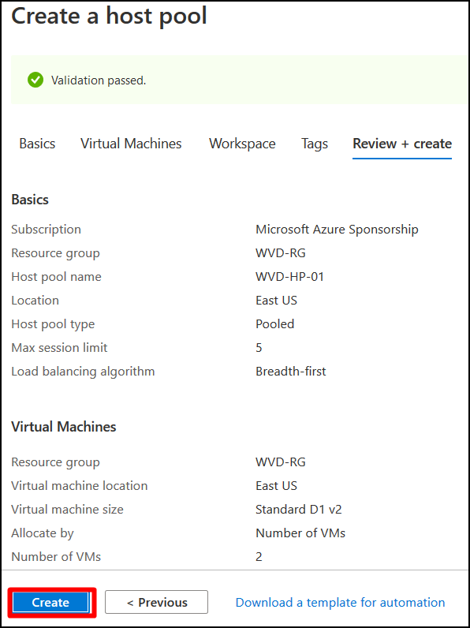
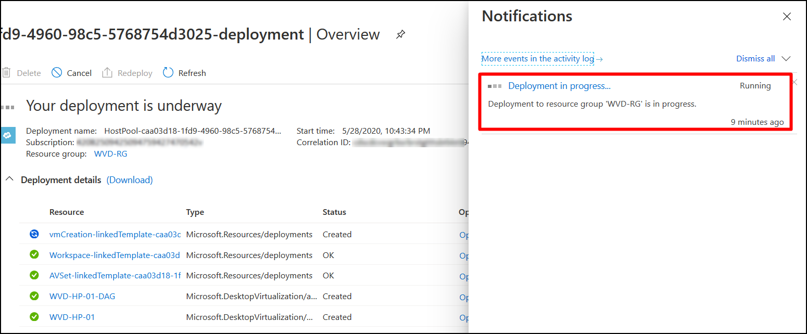
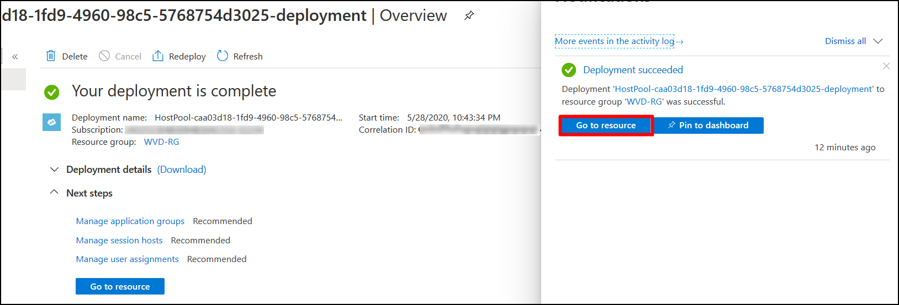
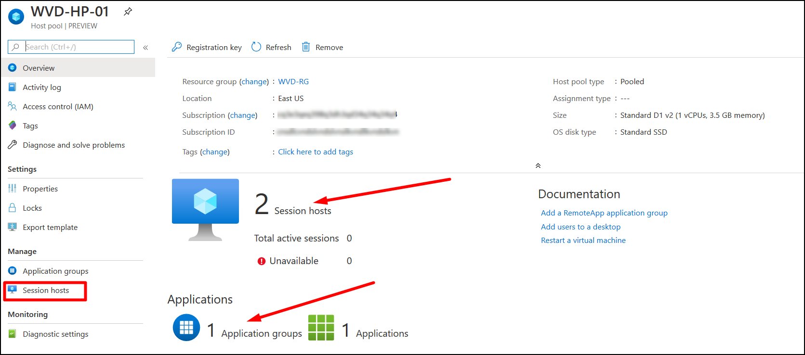

# **Exercise 3: Create Host Pool from Azure Portal** 

 
 Host pools are a collection of one or more identical virtual machines within Windows Virtual Desktop environments. Each host pool can contain an app group that users can interact with as they would on a physical desktop. 
 
### **Task 1: Create Host pool**

In this exercise we will be creating a host pool named *WVD-HP-01* of pooled type and add two session hosts (virtual machines) i.e. *WVD-SH-0* and *WVD-SH-1*  then register them under a new workspace named *WVD-WS-01*.

1. Login to the Azure portal using the credentials in the Lab Environments section. 

2. Navigate to **Azure portal** and search for *Windows virtual* in the search bar and select **Windows Virtual Desktop** from the suggestions.

  
 

3. You will be directed towards the Windows Virtual Desktop(Hereafter referred as WVD) management window.  

  

4. Now select **Host pools** under **Manage** blade and then click on **+ Add** to add new Host Pool.

  

5. Creating a Host Pool is divided into multiple sections. The first one is the Basic section. All the fields in this section are explained below along with the values: 

 **A.** **Project Details –** Defines the environment 

   - Subscription: *Choose the default subscription*.
   - Resource Group: *Select **WVD-RG** from the drop down*.
   - Host Pool Name: **WVD-HP-01**
   - Location: **East US**, *basically this should be same as the region of your resource group*.      
   - Validation environmet: **No**
      
>**Note:** Validation host pools let you monitor service updates before rolling them out to your production environment.
            
 **B.** **Host Pool Type –** Defines the type of host pool. 

   - Host pool type: **Pooled** 
      
   >**Note:** Host Pools are of 2 types: Pooled and Personal.  
   > **Pooled** is used to share the same Session Host (Virtual Machine) resources among multiple users.
   > **Personal** uses a dedicated Session host of individual user.

   - Max session Limit: **5**
      
   > **Note:** Max session Limit limits the simultaneous number of users on the same session host.
     
   - Load Balancing Algorithm: **Breadth First**
      
   > **Note:** Load Balancing Algorithm are of 2 types: *Breadth-first* and *Depth-first*. 
   > - **Breadth-first** load balancing distributes new user sessions across all available session hosts in the host pool. 
   > - **Depth-first** load balancing distributes new user sessions to an available session host with the highest number of connections but has not reached its maximum session limit threshold.
     
   - Then click on **Next:Virtual Machines**.
          
    

6. In the Virtual machines tab, select **Yes** against **Add virtual machines**. By doing this, we are stepping towards adding Virtual machines to the host pool. 

  

8. Now a long list of parameter appears. These can be categorized into three: Session Host specifications, Network and Security, Domain and Administrator account. 

   **A**. Session Host Specifications

     In this section, we provide the details of the VMs to be created as session Hosts.    

     - Resource Group: *Select **WVD-RG** from the drop down*.
     - Virtual machine location: **East US**, *location should be same as location of your resource group*.
     - Virtual machine size: **Standard D1_v2**. *Click on **Change Size**, then select **D1_v2** and click on **Select** as shown below*
   
  

     - Number of VMs: **2**   
     - Name prefix: **WVD-HP01-SH** 
     - Image type: **Gallery**
     - Image: **Windows 10 Enterprise multi-session, version 1909 + Office 365 ProPlus** *(choose from dropdown)* 
     - OS disk type: **Standard SSD**
     - Use managed disks: **Yes**
   
  
   
   
  **B**. Network and Security 
   - Subnet: *Choose **sessionhosts-subnet (10.0.1.0/24)** from the dropdown*.     
   - Leave all other values on default. 
 
**Virtual Network**: Default value

    **Subnet**: Default value

    **Public IP**: Default value

    **Network security Group**: Default value

    **Public inbound ports**: Default value
 
  
 
   **C**. Domain and Administrator account 

  
 

    **Specify Domain or Unit**: No 

    **AD domain join UPN**: Provide the username from ‘Lab Environment’ Tab

    **Password**: Provide the password from the ‘Lab Environment’ Tab

    **Confirm Password**: Confirm the password from the ‘Lab Environment’ Tab
   
9. Click on Next:Workspace to proceed. 

10. In the Workspace section, we need to specify if we need to register the default application group with a workspace. 

  
    
    
     **Register desktop app group:** Yes 

     **To this workspace:** Create new
    
11. Once you click the **Create new**, a small window pops up, where you can specify the Workspace name you are going to create.  

  

     **Workspace name:** WVD-WS-01 

     Click **OK** 

12. Once we fill up all the parameters, click on the  **Review + create** button on the bottom left corner. 

  

13. The last window helps us verify if the parameters we filled are correct. If yes, click on Create to initiate the deployment. 

  

14. The deployment starts, wait until the deployment gets succeeded.  

  

  
 
 
Click on **Go to Resource**.

15. You will see that the **Hostpool WVD-HP-01** is created with 2 session hosts in it, and a default application group (of type Desktop). 

Click on **Session Hosts** 

  

16. Notice the Session Hosts created, with a name concatenating the Name Prefix and increment number. 

  

