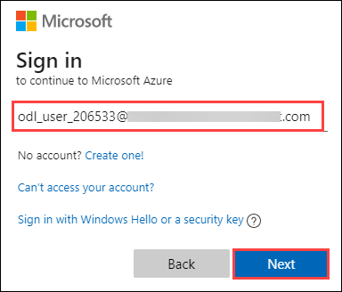
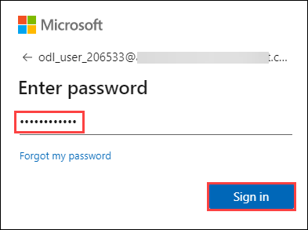
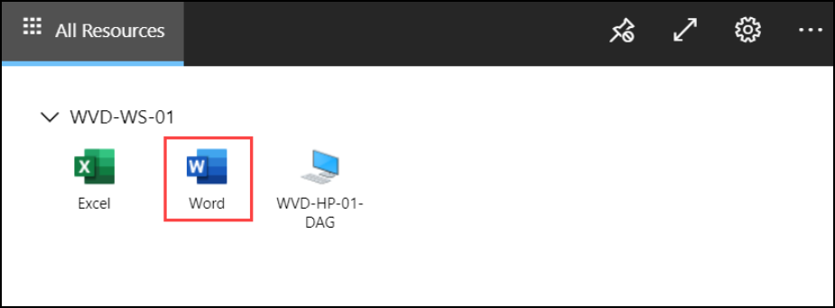
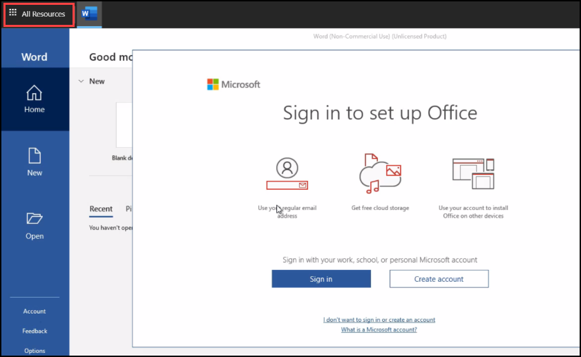
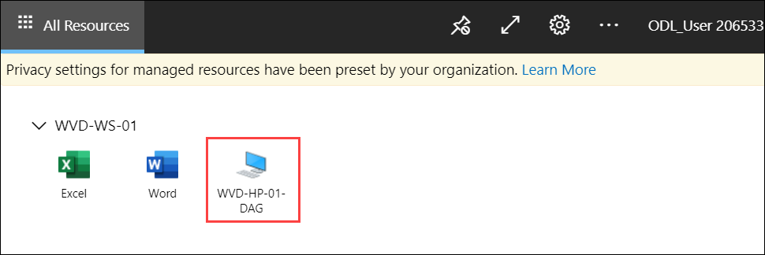
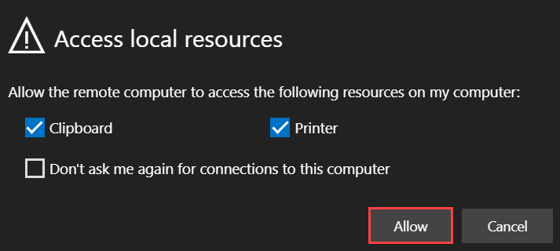

# **Exercise 5: Access the Published Applications/ Desktop using Browser**

## **Task 1: Access the Published Apps**

Now as we have published remote apps in previous exercise, now we will be accessing them using web browser.

1. Use the link ```aka.ms/wvdarmweb``` and enter your **credentials** to login. 

   - Username: *Paste your username* **<inject key="AzureAdUserEmail" />** Then click on **Next**.*
   
   

   - Password: *Paste the password* **<inject key="AzureAdUserPassword" />** *and click on **Sign in**.*

   
  

2. Now you will be inside the WVD dashboard with all the Desktop and Applications visible. Click on any one of the applications to access it. 

   


3. Click on **Allow** for the prompt.

   


4. Enter your **credentials** to access the application and click on **Submit**.

   - Username: *Paste your username* **<inject key="AzureAdUserEmail" />** 
  
   - Password: *Paste the password* **<inject key="AzureAdUserPassword" />**

   
      
5. Your application will launch.

   

## **Task 2: Access the published Desktop**

1. Now on the top-left side click on **All Resources** and select **WVD-HP-01-DAG** Desktop.
   
   
   
   
2. Now you will be inside the WVD dashboard with all the Desktop and Applications visible. Click on the **Desktop** to access it. 

   


3. Click on **Allow** for the Prompt.

   


4. Enter your **credentials** to access the application and click on **Submit**.

   - Username: *Paste your username* **<inject key="AzureAdUserEmail" />** 
  
   - Password: *Paste the password* **<inject key="AzureAdUserPassword" />**

   


5. Your virtual Desktop will launch and it should be ready to use. 

   
   
6. Click on the **Next** button.
