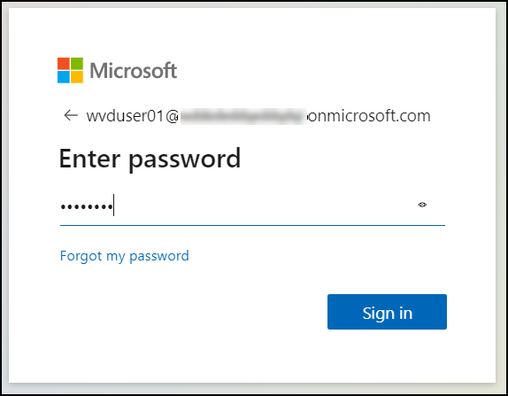
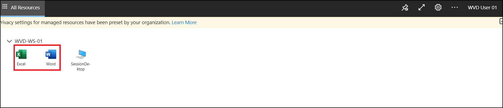
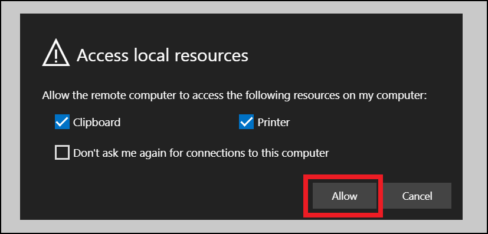
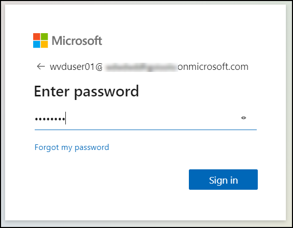
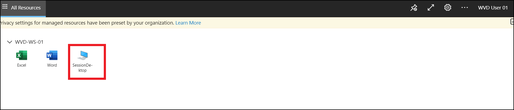
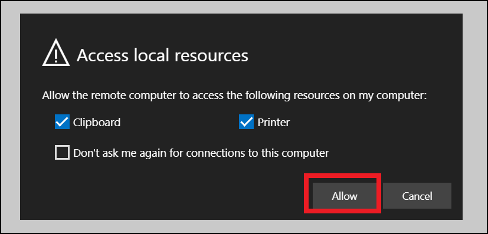

# **Exercise 5: Access the Published Applications/ Desktop using Browser**

## **Task 1: Access the Published Apps**

Now as we have published remote apps in previous exercise, now we will be accessing them using web browser.

1. Use the link [**aka.ms/wvdarmweb**](aka.ms/wvdarmweb) and enter your **credentials** to login. 

   
  

2. Now you will be inside the WVD dashboard with all the Desktop and Applications visible. Click on any one of the applications to access it. 

   

3. Click on **Allow** for the prompt.

   

4. Enter your **credentials** to access the application.

   

5. Your application will launch.

   

## **Task 2: Access the published Desktop**

In this task we will be accessing the desktop type application named *WVD-HP-01-DAG* created by default when we created *WVD-HP-01* host pool using browser.

1. Use the link [**aka.ms/wvdarmweb**](aka.ms/wvdarmweb) and enter your credentials to login. 

   

2. Now you will be inside the WVD dashboard with all the Desktop and Applications visible. Click on the **Desktop** to access it. 

   

3. Click on **Allow** for the Prompt.

   

4. Enter your **credentials** to access the application.

   

5. Your virtual Desktop will launch and it should be ready to use. 

   
   

