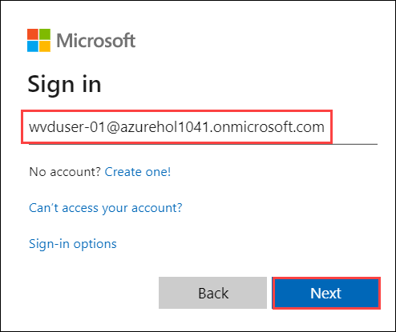
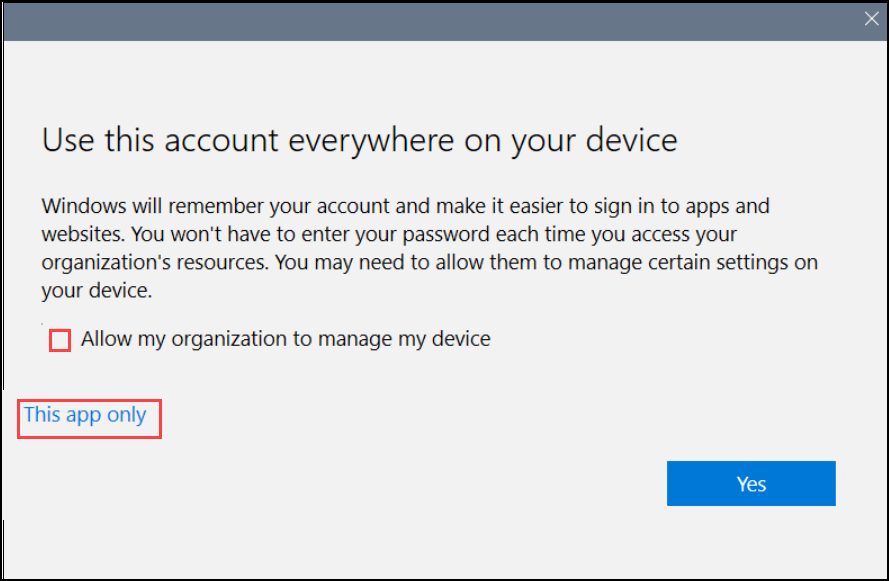
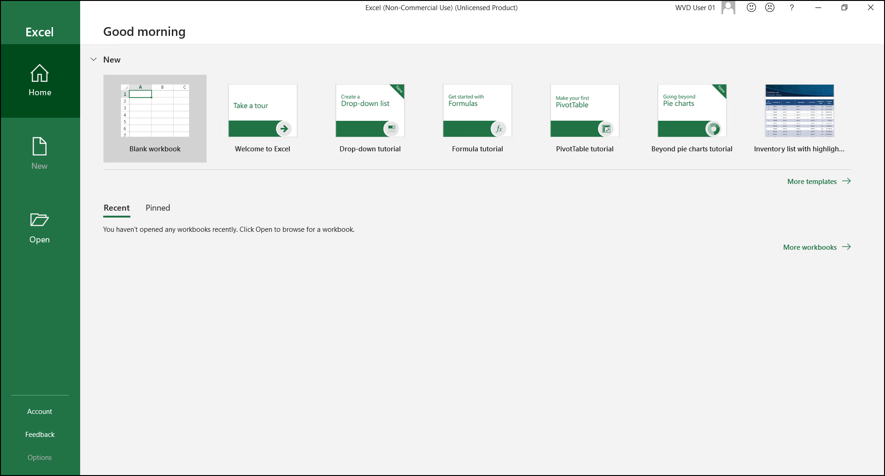
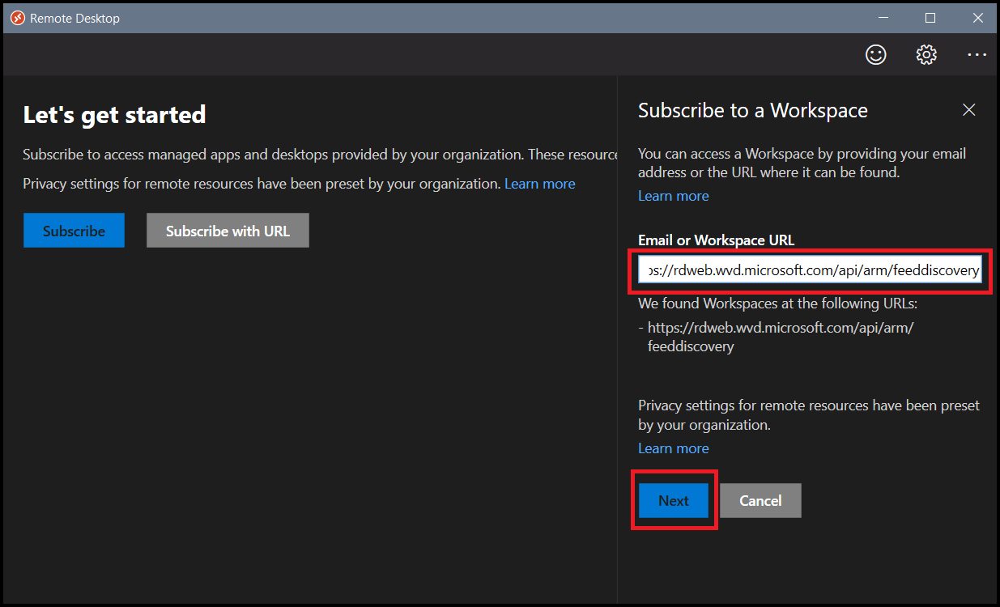
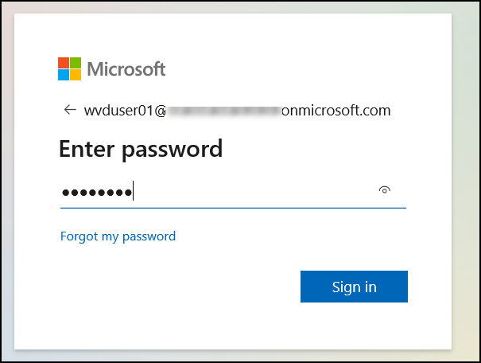
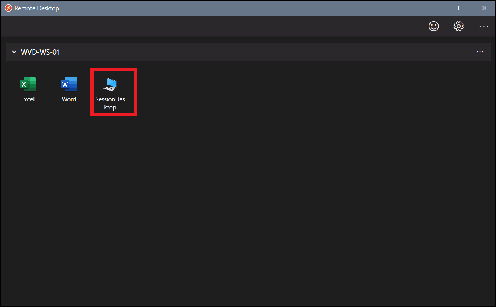
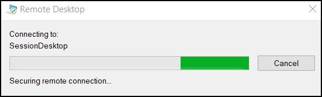

# **Exercise 6: Access the Published Applications/ Desktop using WVD Client**

WVD-Client is a remote desktop application through which we can connect to our windows virtual desktop environment.

## **Task 1: Access the Published Applications using WVD Client**

Now as we have published remote apps in previous exercises, now we will be accessing them using wvd-client.

1. Download the **WVD Client** on your local machine from the following [**Link**](https://docs.microsoft.com/en-us/azure/virtual-desktop/connect-windows-7-and-10) and install **Windows 64-bit** version by clicking on it.
   
   
   
   
2. Then open the setup and click **Next** on the Welcome page of setup.

3. Check the agreement box and click on **Next**.

4. On **Installation scope** window select **Install just for you** and then click on **Install**.

   

5. After installation, in your local machine go to **Start** and search for **Remote desktop** and open the application with exact icon as shown below.

   
   
   
6. After the application opens click on **Subscribe with URL**. Then enter the following URL ```https://rdweb.wvd.microsoft.com/api/arm/feeddiscovery``` and click on **Next**.

   
  
  
7. Enter your **credentials** to access the workspace.

   - Username: *Put odl username which can be obtained from lab environment page (for example: **odl_user_206342@azurehol1022.onmicrosoft.com**). Then click on **Next**.*
   
   

   - Password: *password of the environment* and click on **Sign in**.

   
   
   
8. Make sure to **uncheck** Allow my organization to manage my device.

   Click on **This app only**.

   
   
   
9. Now click on any of the applications to access it.

   
   

10. Enter your **credentials** to access the Application.

   
   

11. Wait for your application to connect.

   
   

12. Your Application will launch and will be ready to use.

    
    
    

## **Task 2: Access the Workspace Desktop using WVD Client**

In this task we will be accessing the desktop type application named *WVD-HP-01-DAG* created by default when we created *WVD-HP-01* host pool using wvd-client.

1. In your local machine go to **start** and search for **Remote desktop** and open the Application with exact exact Icon as shown below.

   


2. After the application opens click on **Subscribe with URL**.

   
  
  
3. Enter the following URL **https://rdweb.wvd.microsoft.com/api/arm/feeddiscovery** and click on **Next**.

   
   
   
4. Enter your **credentials** to access the Workspace.

   
   
   
5. Make sure to **uncheck** Allow my organization to manage my device.

   Click on **Yes**.

   
   
   
6. Now Click on any of the Desktop to access it.

   
   

8. Enter your **credentials** to access the Desktop.

   
   

9. Wait for your Desktop to connect.

   
   

10. Your virtual Desktop will launch and it should be ready to use.
        
       
     
 11. Click on the **Next** button.   
